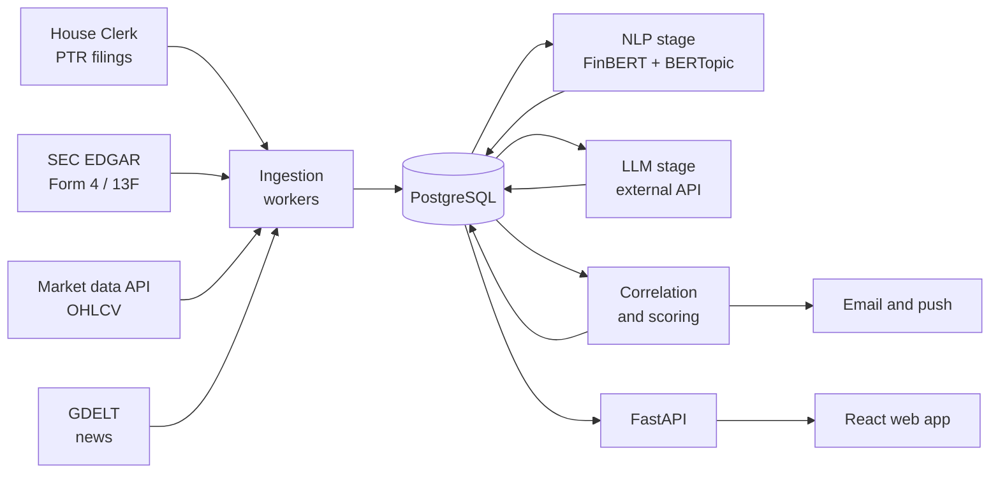
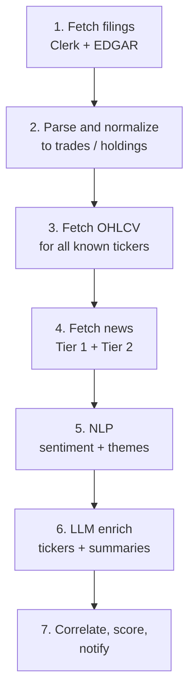

# Market Intelligence Platform — Technical Specification

Sep 17, 2026 · Author: @Someone

## Summary

This system turns four public data streams — congressional trade disclosures, SEC insider and institutional filings, daily market prices, and global news — into a small number of ranked, explained signals delivered once a day.
The core claim it tests: disclosed trades by politicians, corporate insiders, and large funds are individually noisy, but become interesting when they coincide with a volume anomaly and a concurrent news theme affecting the same ticker. The system's job is to find those coincidences automatically and explain each one in a sentence a human can act on or dismiss in five seconds.
It is a single-operator system. One user, daily batch cadence, roughly $15–26/month in running cost, deployed on one CPU droplet with no GPU anywhere in the production path.

## Goals and non-goals

v1 ships when a user can search any tracked investor, see their disclosed positions and trades, and receive a daily email containing zero to five signals that each name a ticker, a trigger, and a reason.
**Goals**
1. Ingest congressional PTRs, SEC Form 4, and Form 13F on a daily schedule with no manual intervention.
2. Maintain daily OHLCV and derived volume statistics for every ticker that appears in any filing.
3. Discover news themes without a predefined topic list, and map each theme to affected tickers.
4. Emit ranked signals that combine filing activity, volume anomaly, theme relevance, and sentiment.
5. Run under $30/month all-in, including LLM API spend.
**Non-goals for v1**

| Excluded | Why |
| --- | --- |
| Intraday or real-time data | Source filings have 2–45 day latency; sub-daily refresh adds cost and no information |
| Order execution or broker integration | Regulatory surface far exceeds the value of the research product |
| Multi-tenant accounts, billing, org roles | One operator; auth is a single credential, not a system |
| Self-hosted LLM inference | Rejected on cost and operational load — see Risks and rejected alternatives |
| Options, futures, fixed income | Filing coverage is thinnest here and parsing cost is highest |
| Backtested return claims shown in the UI | Requires survivorship-safe historical data the system will not have until year two |

The last exclusion matters most. The system reports what was disclosed and what co-occurred. It does not assert that following a signal would have made money.

## User and use cases

One user, technical, checking a phone over morning coffee and a laptop on weekends. This shapes every interface decision: the email must be readable without opening the app, and the app must be usable on a 390px screen.
Five jobs the system must do well:

| Job | Entry point | Success looks like |
| --- | --- | --- |
| "Did anything worth my attention happen overnight?" | Daily digest email | 0–5 signals, each one line, each linked to a detail page |
| "What does this person hold and what did they just do?" | Investor search | Positions, trades, sector mix, all on one screen |
| "Why is this ticker moving?" | Ticker page | Price and volume chart, filings within ±30 days, themes touching it |
| "What is the market talking about this week?" | Themes explorer | Ranked discovered themes, their tickers, aggregate sentiment |
| "Tell me when X happens" | Alert preferences | Rule by investor, ticker, signal type, or conviction floor |

The digest is the primary surface. If the user never opens the web app in a given week, the product should still have been worth running. The app exists to answer the follow-up question the email provokes.

## System architecture

The system is a batch ETL pipeline with a read-only API in front of it. There is no streaming path, no message queue, and no worker fleet. PostgreSQL is the only stateful component.



Every stage reads from and writes to Postgres rather than passing objects in memory. This is deliberate: each stage is independently re-runnable, a failure in the LLM stage does not lose the day's ingested filings, and any stage can be debugged against yesterday's real data with a single query.
**Why batch, not streaming.** The freshest input is Form 4, which arrives two business days after the trade. Congressional PTRs arrive 30–45 days after. A streaming architecture would deliver stale data faster and cost an order of magnitude more to run. Daily batch matches the information rate of the sources.
**Why one machine.** Peak daily workload is a few thousand articles through a 110M-parameter classifier and one topic-model refit. This is minutes of CPU, not hours. Horizontal scale is a problem this system does not have and should not pay for.

## Data sources

All five sources are free and public. None require a commercial license for personal use. Latency below is the gap between the real-world event and the data becoming available.

| Source | Content | Filing deadline | Practical latency | Format | Fragility |
| --- | --- | --- | --- | --- | --- |
| House Clerk PTRs | Congressional trades over $1,000 | 30–45 days | 30–50 days | PDF, often scanned | High — layout varies by member |
| SEC EDGAR Form 4 | Officer, director, 10%+ owner trades | 2 business days | 2–4 days | XML | Low — stable schema |
| SEC EDGAR Form 13F | Fund holdings, $100M+ managers | 45 days after quarter end | 45–50 days | XML | Low |
| Market data (Yahoo Finance, fallback Finnhub) | Daily OHLCV | — | Next morning | JSON | Medium — unofficial endpoints change |
| GDELT GKG | Global news, 15-min updates | — | Under 1 hour | CSV over GCS | Medium — schema drift, volume spikes |

**Congressional filings are the hard problem.** PTRs are PDFs, frequently scanned images, with no consistent table structure. Values are disclosed as ranges ($1,001–$15,000, $15,001–$50,000, and so on) rather than exact amounts, and spouse trades are marked SP with the member as the filer of record. The parser must tolerate all of this and must never silently coerce a failed parse into a zero.
**13F is a lagging, incomplete picture.** It reports long US equity positions at quarter end only. Shorts, derivatives, and non-US holdings are absent, and a position opened and closed within a quarter never appears. Treat 13F as slow-moving conviction, never as a trade signal.
**Quarterly load spikes.** 13F deadlines cluster around Feb 14, May 15, Aug 14, and Nov 14. The ingestion job must handle a several-thousand-filing day four times a year without timing out, which means chunked fetching and resumable cursors rather than one long transaction.
SEC requires a descriptive User-Agent header with contact information on all EDGAR requests and rate-limits to roughly 10 requests per second. The client enforces both.

## Ingestion pipeline

This describes the pipeline's steady-state design from Phase 2 onward. In Phase 1 the same stages exist as plain functions run by hand from the CLI for a given date — no scheduler is involved yet, and the last two stages (news/NLP, correlate & notify) don't exist until Phases 4–5.
Seven stages run in sequence each day. Each is a separate APScheduler job with its own row in a pipeline_runs table recording start, end, rows written, and outcome.



**Idempotency.** Every stage is safe to re-run for a given date. Filings key on the SEC accession number or the Clerk document ID; market rows key on (ticker, date); articles key on a hash of the source URL. All writes are INSERT ... ON CONFLICT DO UPDATE. Re-running the whole day changes nothing except processed_at timestamps.
**Failure isolation.** A stage that fails does not block later stages that do not depend on it. If GDELT is unreachable, stages 5 and 6 are skipped and stage 7 still runs against filings and volume alone — signals that day simply carry lower conviction because the news factor is absent, and the digest says so. A failed filing parse quarantines that document to a parse_failures table with the raw bytes retained for manual replay; it never produces a partial trade row.
**Backfill.** The same job functions accept a date parameter, so history is loaded by running the pipeline over a date range. Initial load targets three years of Form 4 and eight quarters of 13F. Congressional PTR backfill is the longest job and runs once, overnight, out of band.
**Universe growth.** The tracked ticker set is not fixed. Any ticker appearing in a new filing is added to the universe, which triggers a backfill of its price history on next run. This means stage 3's workload grows over time and should be measured, not assumed.

## Data model

PostgreSQL, nine core tables plus two operational ones. The schema keeps filings, prices, news, and signals in separate lineages that join only on ticker and date.

```sql
investors        (id, name, type, external_id, source, cik, first_seen, last_seen)
holdings         (id, investor_id, ticker, shares, value_usd, pct_of_portfolio,
                  as_of_date, filing_id)
trades           (id, investor_id, ticker, trade_date, filing_date, direction,
                  value_low, value_high, is_spouse, asset_type, accession_no)
market_data      (ticker, date, open, high, low, close, adj_close, volume,
                  volume_ma_20, volume_ma_50, pct_1d, pct_1w, pct_1m,
                  PRIMARY KEY (ticker, date))
news_articles    (id, url_hash, source_url, published_at, title, body,
                  sentiment_label, sentiment_score, processed_at)
themes           (id, label, keywords, representative_docs, first_seen,
                  last_seen, article_count)
article_themes   (article_id, theme_id, relevance, PRIMARY KEY (article_id, theme_id))
theme_tickers    (theme_id, ticker, confidence, method, PRIMARY KEY (theme_id, ticker))
signals          (id, ticker, signal_type, conviction, components JSONB,
                  rationale, window_start, window_end, created_at, alert_sent)
pipeline_runs    (id, stage, run_date, started_at, ended_at, rows_written, status, error)
parse_failures   (id, source, document_ref, raw_blob, error, created_at, replayed_at)
```

**Three decisions worth stating.**
trades stores value_low and value_high rather than a single amount, because congressional disclosure is banded. Any aggregate over these columns must carry both bounds through to the UI. Collapsing to a midpoint at write time destroys information and invents precision.
signals.components is JSONB rather than columns, because the factor set will change as scoring is tuned. Each signal records the exact inputs that produced it — volume z-score, theme id, sentiment mean, trade ids — so a score can be audited or recomputed months later without re-deriving anything.
theme_tickers.method records whether a ticker was attached to a theme by exact symbol match, company-name match, or LLM inference. These have very different error profiles, and the signal scorer weights them differently.
**Entity resolution** is the quiet source of most data bugs. The same fund appears as "Berkshire Hathaway Inc", "BERKSHIRE HATHAWAY INC", and a bare CIK across sources. Resolution order: CIK when present, then normalized name match against an alias table, then a new investor row. Merges are recorded, never destructive — an investor_aliases table maps duplicates to a canonical id so a bad merge is reversible.
**Indexing.** trades(ticker, trade_date), trades(investor_id, filing_date), market_data(ticker, date DESC), signals(created_at DESC, conviction DESC), and a GIN index on news_articles full text. **Retention** is unbounded for filings and signals, and article bodies are truncated after 180 days once themes and sentiment are derived — the derived rows are what the product uses.

## ML design decisions

Three modeling components: sentiment classification, unsupervised theme discovery, and ticker attribution. Each was chosen against a cheaper and a more expensive alternative.

| Component | Choice | Alternatives rejected | Reason |
| --- | --- | --- | --- |
| Sentiment | FinBERT (~110M params, CPU) | VADER / lexicon; LLM-per-article | Lexicons miss financial negation ("beat lowered expectations"); LLM costs 100x for a three-class label |
| Theme discovery | BERTopic over MiniLM embeddings | LDA; fixed keyword list; LLM clustering | LDA needs a fixed *k* and produces incoherent financial topics; a keyword list cannot discover "memory shortage" before someone names it |
| Ticker attribution | Exact match → alias match → LLM fallback | LLM for everything; regex only | Cascade resolves ~85% deterministically at zero cost; LLM handles only the residual |

**Sentiment.** FinBERT runs on CPU at roughly 40–60 short documents per second, which covers the daily volume in minutes. Scores are stored as both label and continuous score. The system uses article-level scores only in aggregate — a theme-level or ticker-level mean over a window — never to make a claim about a single article, because per-article financial sentiment accuracy is in the high 70s to mid 80s and individual predictions are not trustworthy.
**Theme discovery** is the genuinely novel part and the hardest to get right. BERTopic embeds articles, reduces with UMAP, clusters with HDBSCAN, and labels clusters by c-TF-IDF. Two properties matter here. It does not need *k* specified in advance, and it assigns outliers to a noise cluster rather than forcing every article into a topic — which is correct, since most daily news is not a theme.
The operational problem is **topic instability**: refitting daily produces different cluster ids for the same underlying theme, which breaks any notion of a theme persisting or growing. The design handles this with a fit-once, transform-daily approach — the model is fit on a 90-day corpus and refit monthly, with daily articles assigned via transform(). Across refits, new topics are matched to existing themes rows by cosine similarity of topic embeddings above a threshold; matches update the existing row, misses create a new one. Theme identity therefore survives refits, and "this theme is three weeks old and accelerating" becomes a statement the system can make.
Minimum cluster size starts at 15 articles. Below that, clusters are noise dressed as insight.
**Ticker attribution** runs as a cascade, cheapest first. Exact symbol mentions and a curated company-name alias table resolve most cases. Only articles in a theme cluster with no resolved ticker go to the LLM, with a prompt constrained to return symbols from the known universe. Every attribution records its method, and LLM-derived attributions are capped in their contribution to conviction — an inferred link is weaker evidence than a named one.
**Cold start.** Themes need roughly 30 days of corpus before clusters are stable. The system is useful from day one on filings and volume; theme-bearing signals should be suppressed until the corpus is deep enough, rather than shipping noisy themes and training the user to ignore them.

## LLM integration

The LLM is a hosted API called during the nightly batch, never on the request path. A user page load never triggers inference, so API latency and outages cannot degrade the app.
Four call sites, each with a fixed prompt contract and a strict output schema:

| Call site | Input | Output | Volume/day |
| --- | --- | --- | --- |
| Ticker extraction | Article title + first 500 tokens | JSON array of symbols from known universe | ~50–200 residual articles |
| Theme labelling | 10 representative docs + c-TF-IDF terms | Short human-readable theme name | ~5–20 new themes |
| Signal rationale | Signal components as structured JSON | One or two sentences of plain English | ~0–10 signals |
| Digest assembly | Day's signals | Email body | 1 |

**Provider.** An open-weights model served by Together AI or Groq at roughly $0.20–1.00 per million tokens. Frontier models cost several times more and the tasks here — constrained extraction, short labelling, templated explanation — do not need frontier reasoning. The provider sits behind a thin adapter so switching is a config change.
**Hallucination containment.** Ticker extraction is validated against the known universe and any symbol not in it is dropped, not stored. Signal rationales are generated *from* the already-computed components, never from raw articles — the LLM explains a decision the deterministic scorer already made, so it cannot invent a signal. If the model returns malformed JSON twice, the stage falls back to the deterministic template and logs it.
**Cost control.** Budget is roughly 300k–800k tokens/day, or $10–20/month. A hard daily token ceiling is enforced in the adapter; on breach, the stage degrades to deterministic labels and the run is flagged rather than overspending silently. Prompts and responses are cached by input hash, so re-runs cost nothing.
**Why not self-hosted.** Running a 34B–72B open model needs 24–48GB of VRAM. Cloud GPU instances start near $300/month and a local box is $600–1,200 up front plus around $200/year in power, against $10–20/month for an API serving a few hundred short calls a day. Self-hosting was examined in detail and rejected on cost and operational load. Model experimentation — fine-tuning, evaluating new open-weights releases — happens separately on free Colab or Paperspace tiers and never touches the production path.
A Claude consumer subscription does not include API access; API usage is billed separately per token. Any Claude API use here is a metered cost line, not something the subscription covers.

## Signal detection

**This section describes the final v1 scoring model, not Phase 1.** Phase 1 does not require factors to align — it surfaces every disclosed buy or sell it finds, on its own, with no conviction threshold. The correlation and scoring logic below is introduced in Phase 5, once filings, prices, and news have all been ingested and there is something to correlate against.

A signal is a ticker plus a window in which two or more independent factors aligned. Scoring is deterministic and rule-based in v1 — there are no labels to train on, and a learned scorer without ground truth would be a confident guess.
Four factors, each computed over a ±5 day window around a filing date, with a ±30 day secondary window:

| Factor | Measure | Contribution |
| --- | --- | --- |
| Filing activity | Count and size of trades; cluster bonus when 2+ distinct filers act the same direction | 0–4 |
| Volume anomaly | z-score of volume against trailing 50-day mean | 0–3 |
| Theme relevance | Theme touching the ticker active in-window, weighted by attribution method | 0–2 |
| Sentiment | Mean FinBERT score across theme articles, direction-matched to the trade | 0–1 |

Conviction is the sum, capped at 10. A signal requires at least two factors above zero and a floor of 4 — a lone insider purchase is a fact on the ticker page, not a signal in the digest.
**Direction matters.** A cluster of insider buys with positive theme sentiment scores higher than the same buys against negative sentiment. Mismatched direction caps conviction at 5 and the rationale names the conflict, because disagreement between factors is itself informative.
**Asymmetry of sells.** Insider sales are far more common than purchases and are frequently mechanical — 10b5-1 plans, option exercises, tax lots. Sells carry roughly half the weight of buys, and any sale flagged as a planned-sale transaction is excluded from scoring entirely.
**Volume needs care.** A z-score against a 50-day mean produces false positives around earnings, index rebalancing, and quad-witching days. v1 excludes known earnings dates from volume scoring; index events are a known gap listed in Risks.
**Rate limiting the digest.** At most five signals per day, ranked by conviction. If a day produces twelve, the user sees the top five and a count of the rest. A digest that regularly runs long stops being read, which destroys the product's only guaranteed surface.
Every signal is stored with its full component vector whether or not it was sent, so the threshold can be retuned against history without recomputing the pipeline.

## API surface

FastAPI, JSON, read-heavy. Every endpoint serves precomputed rows; no endpoint triggers ingestion or inference.

| Method | Path | Returns |
| --- | --- | --- |
| GET | /api/investors | Paginated list, filterable by type, sortable by recent activity |
| GET | /api/investors/{id} | Profile, current holdings, recent trades, sector mix |
| GET | /api/investors/{id}/trades | Trade history, filterable by ticker and date range |
| GET | /api/tickers/{symbol} | Price and volume series, filings in window, themes, signals |
| GET | /api/signals | Ranked signals; filters for min_conviction, ticker, type, date range |
| GET | /api/signals/{id} | Full component breakdown and rationale |
| GET | /api/themes | Active themes, article counts, sentiment, attached tickers |
| GET | /api/themes/{id} | Theme detail, representative articles, ticker attribution methods |
| GET | /api/search | Cross-entity search over investors, tickers, themes |
| GET/PUT | /api/alerts | Read and update alert rules |
| GET | /api/health | Per-stage status of the last pipeline run |

**Conventions.** Cursor pagination with limit and cursor, default 50 and max 200. All money is USD; banded values return value_low and value_high as separate fields and never a single number. All timestamps are UTC ISO 8601. Errors return {detail, code} with conventional status codes.
**Auth** is a single bearer token in an Authorization header, stored as an environment secret. There is no user table, no registration, no password reset. If the system ever gains a second user, this is the first thing to replace.
**No WebSocket in v1.** An earlier draft included /ws/updates for live dashboard refresh. It is removed: data changes once a day, so a page load is always current and a socket adds a connection lifecycle to maintain for no user-visible benefit.
**Caching.** Responses carry Cache-Control: max-age=3600 since underlying data is immutable between nightly runs. /api/health is never cached.

## Frontend

React, five views, mobile-first. Each view exists to answer exactly one question, and a view that cannot answer its question in one screen is wrong.

| View | Question it answers | Core content |
| --- | --- | --- |
| Signal dashboard | What should I look at today? | Ranked signal cards: ticker, conviction, one-line rationale, factor chips |
| Investor profile | What does this person hold and what changed? | Holdings table, trade timeline, sector donut, filing-lag note |
| Ticker page | Why is this moving? | Price and volume chart with filing markers, themes, related signals |
| Themes explorer | What is the market talking about? | Theme cards with article count trend, tickers, sentiment |
| Alerts | When should I be told? | Rule editor with live preview of how many signals would have matched |

**Two interactions carry the product.** On a ticker chart, filing events render as markers on the volume series, so "the insider bought here, volume tripled there" is a visual fact rather than a claim. On a signal card, tapping a factor chip expands to show the underlying rows — the trades, the articles, the volume numbers — because a signal the user cannot audit is a signal they will stop trusting.
**Disclosure lag must be visible.** Every congressional trade displays both trade date and filing date with the gap stated plainly ("traded 34 days ago, disclosed yesterday"). Showing only the filing date implies an immediacy the data does not have.
**Banded values render as ranges** — "$15,001–$50,000", never "$32,500". Portfolio totals show summed low and high bounds.
**Mobile constraints.** Charts use a touch-friendly library with no hover-only affordances. Tables collapse to stacked cards below 640px. The digest email is the fallback for everything: if a view is unusable on a phone, the email already carried the important part.

## Infrastructure and deployment

One DigitalOcean CPU droplet runs FastAPI, APScheduler, and PostgreSQL in Docker Compose. Frontend is static on Vercel. No Kubernetes, no managed queue, no separate worker tier.

| Component | Service | Tier | Monthly |
| --- | --- | --- | --- |
| Backend, scheduler, database | DigitalOcean Droplet | 2 vCPU / 4GB | $5–6 |
| LLM inference | Together AI or Groq | pay-as-you-go | $10–20 |
| Frontend hosting | Vercel | Hobby | $0 |
| Email delivery | SendGrid | Free (100/day) | $0 |
| Push notifications | Firebase Cloud Messaging | Free | $0 |
| Backups | DO Spaces or off-box pg_dump | — | $0–5 |
| **Total** |  |  | **$15–31** |

**Sizing.** 4GB RAM is the binding constraint, not CPU. FinBERT holds roughly 500MB resident and the BERTopic monthly refit is the memory peak. The refit runs as a separate short-lived container so it cannot starve the API process, and it is scheduled on a weekend night.
**Storage growth** is modest — filings and market rows are small, and article bodies are the only meaningful volume. With 180-day body truncation, steady state is a few GB in year one. The droplet's included volume is adequate; monitoring is set to alert at 70% rather than waiting for a full disk.
**Deployment** is git push to main, GitHub Actions builds and pushes an image, the droplet pulls and recreates. Migrations run with Alembic before the app container starts. Rollback is redeploying the previous tag; schema rollbacks are handled forward-only, since a single-user system has no reason to support backward migration.
**Environments.** Production on the droplet, local development on Docker Compose against a seeded subset. There is no staging tier — the pipeline's date-parameterized jobs mean any stage can be run locally against real historical data, which covers most of what staging would be for.
**Secrets** live in a .env file on the droplet with restricted permissions and in GitHub Actions secrets for CI. No secret is in the repository. The SEC User-Agent contact string is configuration, not a secret, but is set explicitly rather than defaulted.
**Backups** are a nightly pg_dump to off-box object storage with 30-day retention, plus a weekly restore check into a scratch database. An untested backup is not a backup — and the derived layers here represent months of compute that would be expensive to rebuild.
**Rejected: GPU hosting.** DigitalOcean GPU droplets price in the high hundreds to over a thousand per month. Lambda Labs at roughly $0.44/hour and Paperspace were cheaper but still exceed the entire budget for a workload that needs no GPU. A local box — RTX 3090 24GB or similar at $600–1,200 plus around $200/year in power — was considered for the dual purpose of hosting and GPU learning, and separated out: learning happens on free Colab and Paperspace tiers, production stays CPU-only.

## Operations

This section applies from Phase 2 onward, once the pipeline is deployed and scheduled. Phase 1 has no scheduler, no monitoring, and no alerts — you run the CLI and read its report.
All jobs run under APScheduler in UTC. The schedule is ordered so each stage's inputs are complete before it starts, with slack between stages for overruns.

| UTC | Stage | Depends on | Typical runtime |
| --- | --- | --- | --- |
| 05:00 | Fetch filings (Clerk, EDGAR) | — | 5–20 min; hours on 13F deadline days |
| 06:00 | Fetch OHLCV for universe | Stage 1 (new tickers) | 5–15 min |
| 09:00 | GDELT Tier 1 — ticker queries | Stage 1 | 10–20 min |
| 14:00 | GDELT Tier 2 — bulk feed | — | 20–40 min |
| 15:00 | NLP: sentiment + theme assignment | Stages 3, 4 | 15–45 min |
| 16:00 | LLM enrichment | Stage 5 | 5–15 min |
| 17:00 | Correlate, score, notify | All | Under 5 min |

**SLOs.** The digest arrives before 18:00 UTC on at least 95% of days. Filings appear in the system within 24 hours of publication on at least 99% of days. API p95 latency stays under 300ms for cached reads.
**Monitoring.** Every stage writes a pipeline_runs row. A watchdog job at 18:00 checks that all seven stages completed for the current date and emails the operator if any did not. This is deliberately simple: a single-user system does not need Prometheus, but it absolutely needs to not fail silently for three weeks.
Four alert conditions, each to the operator's email:
1. Any stage failed or did not run.
2. Row counts deviate more than 50% from the trailing 7-day median for that stage — catches an upstream format change that parses cleanly into nothing.
3. LLM token ceiling breached.
4. Disk above 70% or database connection failures.
Condition 2 is the one that matters most. Pipelines rarely crash when a source changes format; they quietly produce zero rows, and without a volume check that goes unnoticed until the user asks why nothing has happened lately.
**Runbook basics.** A failed stage is re-run with python -m jobs.run --stage N --date YYYY-MM-DD; all stages are idempotent. Parse failures accumulate in parse_failures and are replayed after a parser fix rather than re-fetched. If a source is down for multiple days, backfill by running the range — no special recovery path exists or is needed.

## Evaluation

Three layers are evaluated separately: data correctness, model quality, and signal usefulness. Conflating them hides which one is broken.
**Data correctness** runs as assertions in the pipeline, not as a separate report.
- Parse success rate per source, tracked daily; a drop below 90% for congressional PTRs pages the operator.
- Reconciliation: sample 20 parsed filings per month against the source document by hand. This is the only way to catch a parser that is confidently wrong.
- Referential checks: no trade without a resolvable ticker, no market row with zero volume on a trading day, no holding with a negative share count.
- Duplicate detection on accession numbers and URL hashes.
**Model quality** needs a labelled set, which has to be built once.
- Sentiment: 200 hand-labelled financial headlines as a fixed eval set. Report macro-F1. FinBERT should land in the high 70s to mid 80s; a drop signals input drift, not model decay.
- Themes: topic coherence (c_v) on each monthly refit, plus a human read of the top 10 themes — coherence scores are a weak proxy and a quick skim catches nonsense clusters they miss.
- Ticker attribution: precision measured on a 100-article sample per quarter, split by method. LLM-inferred attributions are expected to be the weakest and should be measured separately rather than averaged in.
**Signal usefulness** is the hard one, and honesty here matters more than a number.
v1 measures two things: forward return of signalled tickers at 5, 20, and 60 days against a sector-matched baseline, and a manual keep/discard label the user applies to each digest signal. The second is the real metric. If the user discards most signals for a month, the scoring thresholds are wrong regardless of what returns say.
**What v1 explicitly will not claim.** No Sharpe ratio, no backtested strategy return, no "this signal historically returned X%". A year of single-operator data with no transaction costs, no slippage model, and a universe defined by what got filed is not a basis for performance claims. Returns are shown as descriptive context alongside a baseline, labelled as such.
**Tuning discipline.** Because every signal is stored with its full component vector including unsent ones, threshold changes are evaluated by replaying stored components — never by rerunning the pipeline, which would invite fitting the scorer to a handful of memorable outcomes.

## Security, privacy, and legal posture

All ingested data is already public. The system stores no personal data about its user beyond an email address for delivery, and holds no brokerage credentials, account numbers, or positions.
**Security surface** is small and should stay that way. The API is read-only apart from alert preferences. A single bearer token gates it. Postgres binds to localhost only and is never exposed to the internet. TLS terminates at Caddy or nginx with automatic certificates. Dependencies are pinned and scanned by Dependabot.
**Named individuals.** The system stores and displays trading activity attributed to real people, including members of Congress and their spouses. Everything shown comes from a mandatory public disclosure and links back to the source document. Two rules follow: never display a derived claim about a person that the filing does not support, and always show the source link so a reader can check. Spouse-attributed trades must be labelled as such rather than presented as the member's own.
**Scraping conduct.** Requests to SEC EDGAR carry a descriptive User-Agent with contact information and respect the published rate limit. GDELT is consumed through its documented bulk files rather than scraped. If an unofficial market-data endpoint is used, it is treated as revocable — the abstraction layer allows swapping to a keyed API without touching the pipeline.
**Terms of service risk.** Free market-data endpoints may restrict automated or redistributive use. For single-user personal research the exposure is low, but the fallback to a properly licensed provider (Finnhub or Alpha Vantage free tier, or a paid tier if volume grows) is designed in from the start rather than retrofitted after a block.
**Not investment advice.** The system produces research signals, not recommendations. Nothing in it is personalized to financial circumstances, and no output should be read as a recommendation to buy or sell. This framing appears in the UI and the digest footer. It is also the reason execution integration is a non-goal: the moment the system places orders it becomes a different product with a different regulatory surface.
One substantive caveat worth stating in the product itself: disclosed trades are stale by construction. Congressional PTRs arrive up to 45 days after the trade, and 13F holdings are a snapshot up to 50 days old. A signal describes what was disclosed, not what is currently being done.

## Risks and rejected alternatives

| Risk | Likelihood | Impact | Mitigation |
| --- | --- | --- | --- |
| PTR PDF parsing is unreliable across members | High | Congressional coverage incomplete | Quarantine failures, monthly hand-sample, ship Form 4 first |
| Free market endpoint blocks or changes | Medium | Volume factor goes dark | Adapter layer, keyed fallback provider ready |
| Themes are incoherent or unstable | Medium | Theme factor adds noise, not signal | Fit-once/transform-daily, min cluster size, suppress until corpus is deep |
| Signals are numerous but useless | Medium | User stops reading the digest | Conviction floor, 5/day cap, keep/discard feedback loop |
| Silent zero-row pipeline failure | Medium | Weeks of missing data | Row-count deviation alert (Operations, condition 2) |
| Volume false positives around earnings and index events | High | Inflated conviction | Earnings exclusion in v1; index events a known gap |
| LLM cost overrun | Low | Budget breach | Hard token ceiling with deterministic fallback |
| Scope creep into a trading product | Medium | Regulatory and complexity blowup | Execution is a stated non-goal |

**Rejected alternatives, with reasons.**
*Self-hosted LLM on owned or rented GPU.* Needs 24–48GB VRAM for models in the interesting range. Local box $600–1,200 plus ~$200/year power; cloud GPU from ~$300/month. Against $10–20/month for an API, this is a large cost to carry for a workload of a few hundred short calls a day. Rejected — with GPU learning deliberately separated onto free Colab and Paperspace tiers so the goal is not lost, just decoupled.
*Mac Mini as host.* No discrete GPU and shared memory make it a poor fit for large-model inference, and it solves no problem the droplet does not.
*Fully managed cloud (Railway, Render, Neon, Vercel).* Slightly simpler operationally, comparable or higher cost, more vendors to track. A single droplet with Compose is fewer moving parts for one user.
*Building on an existing tracker's data (Quiver, Capitol Trades, AltIndex).* Faster to a working product, but the upstream ETL is the interesting engineering and those services' terms restrict redistribution. Rejected on both counts.
*A learned signal scorer in v1.* No labels exist. A model trained on forward returns over a year of data would fit noise and present it with more confidence than rule-based scoring. Revisit when there are two years of stored components and real keep/discard labels.
*LDA for topic modelling.* Requires *k* in advance and produces topics that read as word soup on financial text. BERTopic's outlier handling is the decisive advantage — most news genuinely belongs to no theme.
**Open questions.**
- ☐ Does the existing codebase already have working SEC EDGAR parsing that should be reused?
- ☐ Greenfield schema, or migrate the existing database?
- ☐ Ship insider tracking end-to-end first, or build all modules in parallel?
- ☐ Which sector classification source — GICS is licensed; SIC from EDGAR is free but coarse.

## Milestones

Five phases, each ending in something usable. The ordering front-loads the cleanest data and defers the hardest parser, so there is a working product before congressional PDFs get a chance to derail the schedule.

**Phase 1 is manual, on demand — not deployed, not scheduled, not emailed.** You run a CLI command whenever you want (`python -m jobs.run --date ...` or a date range), it ingests whatever is new from Form 4 / PTR / 13F, and it prints or writes out a report of every disclosed buy and sell it found — no correlation, no conviction score, no filtering, no threshold. Just "here's what was disclosed." Nothing runs unattended and nothing leaves your machine. Deployment, the daily scheduler, and the email digest are Phase 2+ concerns, once the ingestion and parsing logic is proven correct against real data.

| Phase | Scope | Done when |
| --- | --- | --- |
| 1. Spine (manual, local) | Postgres schema, Form 4 + PTR + 13F ingestion, CLI-triggered run producing a report of all buys/sells found — no scheduler, no email, no deployment | Running the CLI for a date range reliably reports every disclosed trade in that window, and re-running it changes nothing |
| 2. Deploy & read surface | Ship Phase 1 to the droplet, turn on the daily scheduler, add FastAPI endpoints and investor/ticker web views | The pipeline runs automatically every day unattended, and any Form 4 filer is searchable with trades and price context |
| 3. Whales and politicians | 13F ingestion, PTR parser, entity resolution | 13F holdings render; PTR parse rate above 90% on a hand-checked sample |
| 4. News and themes | GDELT both tiers, FinBERT, BERTopic, ticker attribution | Themes explorer shows coherent themes with correct tickers |
| 5. Signals | Correlation scoring, digest email, alert rules | Digest arrives daily; user applies keep/discard labels |

**Phase 1 is the real risk gate, even running manually.** Idempotency still matters — re-running the same date range must not duplicate rows — because Phase 2 will wrap this same code in a scheduler without changing it. Get the ingestion and parsing logic right while it is still just you, a terminal, and a report, before there is a server and a schedule to debug it through.
**Phase 3 is the schedule risk.** PTR parsing is open-ended work against inconsistent scanned PDFs. Timebox it: if the parse rate is stuck below 90% after two weeks, ship what parses, quarantine the rest, and move to Phase 4. Congressional coverage is the marquee feature but it is not the load-bearing one — Form 4 has better latency and far better structure.
**Phase 4 needs a warm-up.** Theme quality is poor until roughly 30 days of corpus exist. Start GDELT ingestion during Phase 2 so the corpus is accumulating in the background while other work proceeds. This costs nothing and removes a month from the critical path.
**After v1.** Backtesting infrastructure once two years of stored components exist, a learned scorer if the labels justify it, and fine-tuning experiments on free GPU tiers — all outside the production path.
